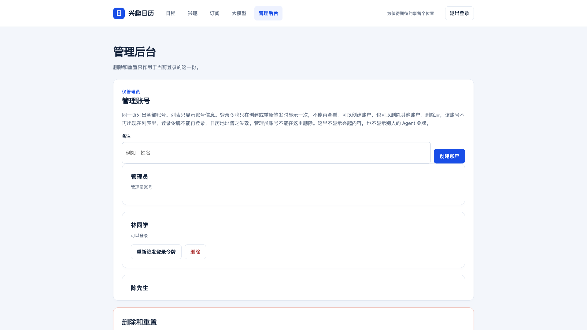

# 兴趣日历

## 产品介绍

**把你关注的事，安排进日常。**

足球比赛、喜欢的歌手演唱会、周末的本地活动、期待的产品发布会——把兴趣告诉日历，让你的 Agent 搜索和核验活动，再把值得关注的日程订阅到手机。

兴趣日历是一个可以部署在自己电脑或服务器上的日历网站。它把 **兴趣配置 → Agent 采集 → 日程展示 → 手机订阅** 连在一起，帮你关注未来 7 天值得期待的事。

<p align="left">
  <a href="docs/images/schedule.png"></a>
</p>

*网站截图使用模拟日程与演示账户。*

### 从喜欢的事开始

填写兴趣，再补充城市、活动类型和偏好，让 Agent 有明确的搜索与筛选范围。

<p align="left">
  <a href="docs/images/interests.png"></a>
</p>

- **关注近期值得期待的活动**：未来 7 天列表、月历和兴趣筛选。
- **每条日程有来源**：详情展示日期、地点、来源摘录和核验时间；不确定的结果留在待核验区。
- **多日活动不刷屏**：日期型活动只在首日展示，标明举办天数，保留完整展期。
- **自由选择 Agent**：使用具备联网搜索和接口访问能力的 Agent，按同一份协议接入。

### 看清楚，再决定去不去

活动时间、地点与介绍集中呈现，来源链接方便查看最新安排。

<p align="left">
  <a href="docs/images/detail.png"></a>
</p>

### 一份公开日历，各自独立的兴趣

管理员维护的日历可以直接查看和订阅。也可以邀请家人、朋友一起使用：每个受邀账户有自己的兴趣、日程、Agent 令牌和订阅地址。

登录后可以处理自己的待核验日程、清空日历或恢复初始状态。管理员负责创建和撤销邀请，账户内容相互隔离。

<p align="left">
  <a href="docs/images/admin.png"></a>
</p>

### 让兴趣变成日程

订阅一次，在熟悉的手机日历里查看下一份期待。新增、改期和取消会随客户端刷新更新。

<p align="left">
  <a href="docs/images/mobile-subscription.png"></a>
</p>

*手机日历效果示意，实际呈现以客户端为准。*

## 安装部署

### 0. 安装依赖

支持 macOS / Linux。下载或克隆仓库，在项目根目录执行：

```sh
./bin/init.sh
```

首次运行需要联网，脚本会安装 Python 和项目依赖。

### 1. 启动并登录

```sh
./bin/start.sh
```

在浏览器打开控制台显示的地址，点击右上角「登录」，输入控制台显示的管理令牌。服务会自动创建数据库和凭据。

本机启动默认探测局域网 IP，使用 HTTP。管理员令牌保存在 `bin/data/credentials.json`。

### 2. 添加兴趣，连接 Agent

登录后，在「兴趣」页填写关注的主题与条件，再进入「大模型」页。

把接入说明发给你的 Agent，按提示提供服务器地址和 Agent 令牌。Agent 需要能够搜索网页并访问该服务器；每个账户连接自己的 Agent。

<p align="left">
  <a href="docs/images/agent-settings.png"></a>
</p>

*截图中的地址与令牌来自独立演示环境。*

### 3. 首次采集与检查

让 Agent 先采集一次，在网站检查日程和来源；待核验的结果可以确认、拒绝或合并。确认效果后，再让 Agent 安排定时采集。

### 4. 订阅到手机

进入「订阅」页，使用页面中的日历地址，按 iOS 或 Android 的步骤添加订阅。

未登录或管理员登录时，订阅公开日历；受邀账户登录后，页面显示自己的个人地址。个人地址带有订阅密钥，请保存给自己使用。

### 5. 后台运行

结束前台服务后，执行：

```sh
./bin/start-background.sh
```

终端会显示访问地址和管理令牌，日志保存在 `bin/data/server.log`。停止服务、备份恢复和容器部署见 [运行指南](bin/README.md)。

### 部署到服务器

公网部署配置 HTTPS 地址，并通过反向代理或证书提供访问：

```sh
BASE_URL=https://calendar.example.com ./bin/start-ecs.sh
```

证书、监听端口、代理和容器配置见 [运行指南](bin/README.md)。

## 进一步了解

| 内容 | 入口 |
| --- | --- |
| 项目立项与产品规划 | [项目规划](docs/项目规划.md) |
| 技术方案与架构设计 | [方案设计](docs/方案设计.md) |
| 源码、测试与开发方式 | [开发说明](src/README.md) |
| Agent 接入与活动筛选规则 | [接入协议](src/app/agent-guide.md) |
| 账户隔离、邀请与订阅 | [账户规格](docs/账户规格.md) |
| 部署、凭据与备份恢复 | [运行指南](bin/README.md) |
| 存储保留与部署约束 | [存储与部署规格](docs/存储与部署规格.md) |

运行数据保存在 `bin/data/`，包括数据库、备份和凭据，不进入 Git。产品截图保存在 `docs/images/`。

## Thanks

谢谢你的关注，欢迎提供建议和意见，联系方式：[lujun.hust@gmail.com](mailto:lujun.hust@gmail.com)
