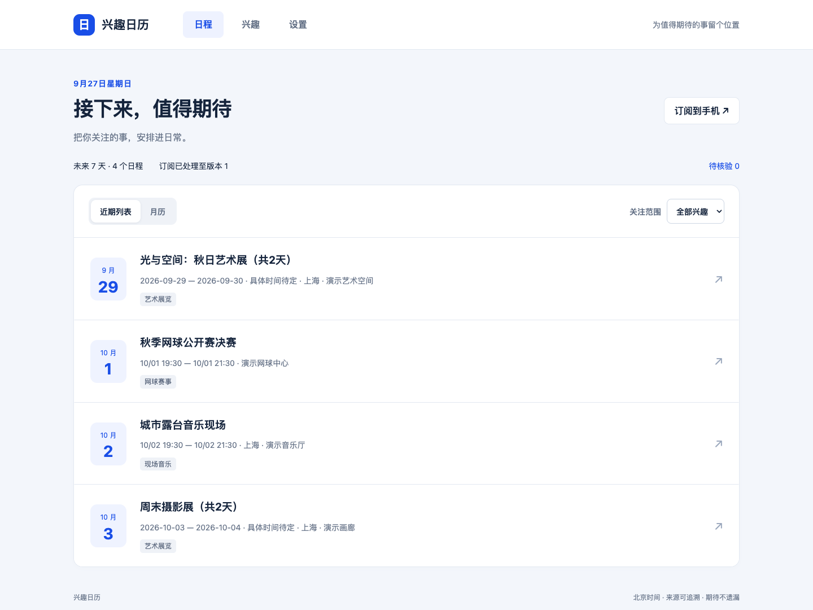
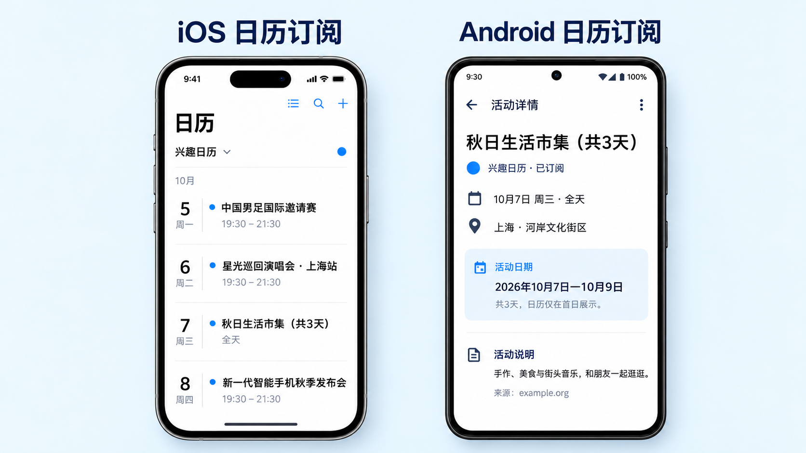
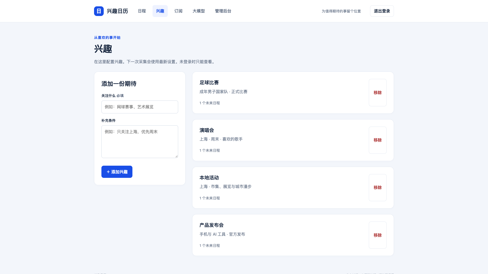
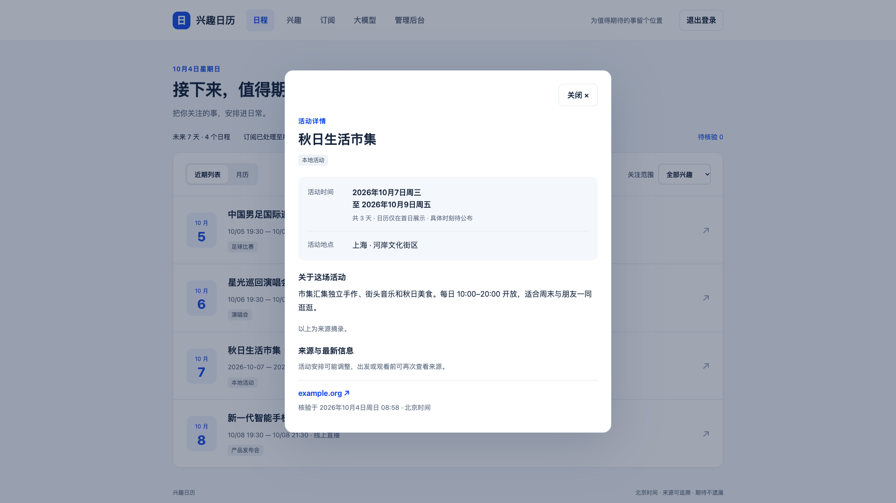
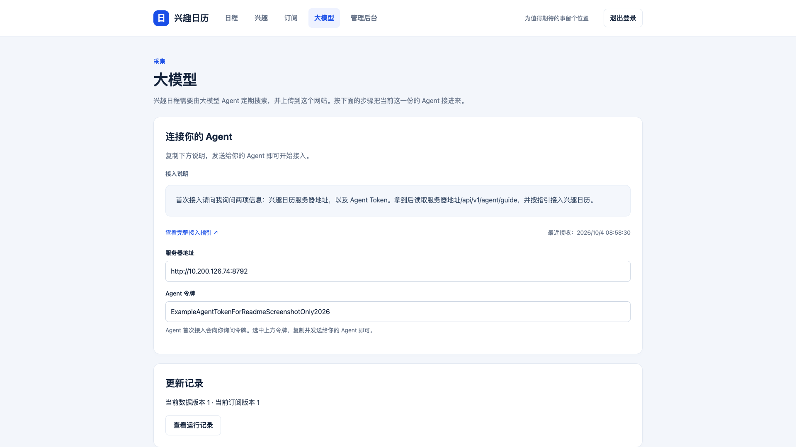

# 兴趣日历

## 产品介绍

**把你关注的事，安排进日常。**

国足下一场比赛、喜欢的歌手演出、周末的展览、期待的产品发布会——把兴趣告诉日历，让你的 AI Agent 搜索和核验活动，再把值得关注的日程订阅到手机。

兴趣日历是一个可以在自己的电脑上运行的个人日历网站和服务。它把 **兴趣配置 → Agent 采集 → 日程展示 → 手机订阅** 连在一起，帮你关注未来 7 天值得期待的事。



*截图来自真实运行的产品页面，活动名称、地点和时间均为虚构演示数据。*

### 让兴趣变成日程

把关注的活动带进手机日历，在熟悉的日程界面里查看下一份期待。



*订阅效果示意，实际呈现以客户端为准。*

- **按你的兴趣发现活动**：填写关注的主题，再补充城市、活动类型等偏好，让 Agent 有明确的筛选范围。
- **聚焦未来 7 天**：近期列表和月历随时切换，也可以按兴趣筛选。
- **每条日程有来源**：查看活动日期、地点、来源摘录和核验时间；不确定的结果可留在待核验区处理。
- **多日活动不刷屏**：连续多日的日期型活动只在月历首日出现，标明举办天数，详情保留完整日期范围。
- **订阅到手机**：提供 ICS 订阅地址，日历客户端刷新后获取新增日程及改期、取消等更新。
- **数据留在自己手里**：SQLite 本地存储，管理员可以清空日历或重置兴趣配置。

### 从喜欢的事开始

告诉日历你关心什么。例如“国足比赛”“上海艺术展览”，再补充“只看成年男足国家队”或“优先周末”等条件。



### 看清楚，再决定去不去

时间、地点和介绍集中呈现，来源链接方便进一步了解活动。连续多日的活动会注明完整举办日期。



## 安装部署

### 0. 安装依赖

支持 macOS / Linux。下载或克隆仓库，在项目根目录执行：

```sh
./bin/init.sh
```

首次运行需要联网，脚本会安装 Python 和项目依赖。

### 1. 在自己的电脑上启动

下面两条命令只用于本机和可信局域网。未设置 `BASE_URL` 时，脚本探测局域网地址并使用 HTTP。公网云主机不要用它们，见文末的云主机一节。

```sh
./bin/start.sh
```

在浏览器打开控制台显示的地址。前台启动时终端会显示管理令牌；令牌原文保存在 `bin/data/credentials.json`。

### 2. 添加兴趣，连接 Agent

在「兴趣」页面填写关注的主题和条件，然后用管理令牌进入「大模型」。

将页面中的接入说明发给 Agent，按提示提供服务器地址和 Agent 令牌。Agent 需要具备联网搜索和访问该服务器的能力。



*图中地址与令牌为示例。*

### 3. 首次采集与检查

让 Agent 先采集一次，在网站检查日程；确认后，再由 Agent 安排定时采集。

### 4. 订阅到手机

在「订阅」页复制日历地址，再按该页的步骤添加到手机。地址不在日程页。未登录时地址形如 `http://<局域网IP>:8787/public/calendar.ics`。固定路径 `/calendar.ics` 没有内容。其他账户登录后，同一页只显示自己的 `/c/<token>/calendar.ics`，不要公开。iOS、Android 和鸿蒙的添加路径不一样，以订阅页为准。快照、日志和备份的上限见 [存储与部署规格](docs/存储与部署规格.md)。

### 5. 后台运行

结束前台服务后，执行：

```sh
./bin/start-background.sh
```

日志：`bin/data/server.log`（启动前和运行中自动轮转，且不记录管理令牌）。停止、备份和恢复见 [运行指南](bin/README.md)。

### 6. 云主机

公网机器（ECS 或其它云虚拟机）用另一条启动路径，不要用上面的本机脚本，也不要靠它们探测局域网 IP。

```sh
BASE_URL=https://calendar.example.com ./bin/start-ecs.sh
```

- 监听仍是程序默认：所有网卡，端口取自 `BASE_URL`，没有写端口时是 8787。脚本不改绑定，也不传 `--dev`。`--dev` 只用于开发；它要求配置的 `BASE_URL` 是回环地址，但进程同样听 `0.0.0.0`，并不是只绑 `127.0.0.1`。
- `BASE_URL` 必须是公网 HTTPS 源。终止 TLS 有两种做法：设置 `CALENDAR_CERT` 和 `CALENDAR_KEY`，脚本会传给已有的 `--cert`/`--key`；或者在反向代理上终止 TLS，由代理转到本机端口。
- 直接在进程上挂证书、且 `BASE_URL` 没写端口时，进程听的是 8787 而不是 443。这时把地址写成 `https://calendar.example.com:8787`，订阅端口才和监听端口一致。反向代理终止 TLS 时，`BASE_URL` 用浏览器和手机看到的源（通常不带 8787）。
- 云防火墙或安全组才是公网大门。不要把 8787 以 HTTP 对 `0.0.0.0/0` 开放。
- 公开订阅地址只在「订阅」页，无需登录，形如 `https://calendar.example.com/public/calendar.ics`，不是 `/calendar.ics`。其他账户的地址仍是各自的 `/c/<token>/calendar.ics`，只在该用户登录后的「订阅」页。
- 容器部署用同样的约束，命令见 [运行指南](bin/README.md)。磁盘上限见 [存储与部署规格](docs/存储与部署规格.md)。

## 进一步了解

| 内容 | 入口 |
| --- | --- |
| 项目立项与产品规划 | [项目规划](docs/项目规划.md) |
| 技术方案与架构设计 | [方案设计](docs/方案设计.md) |
| 源码、测试与开发方式 | [开发说明](src/README.md) |
| Agent 接入细节 | [接入协议](src/app/agent-guide.md) |
| 部署、凭据与运行数据 | [运行指南](bin/README.md) |
| 存储上限与公网边界 | [存储与部署规格](docs/存储与部署规格.md) |
| 邀请账户、页面与订阅路径 | [账户规格](docs/账户规格.md) |

运行数据保存在 `bin/data/`，包括数据库、备份和凭据，不进入 Git。产品截图保存在 `docs/images/`。

## Thanks

谢谢你的关注，欢迎提供建议和意见，联系方式：[lujun.hust@gmail.com](mailto:lujun.hust@gmail.com)
