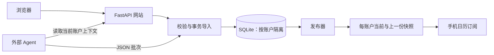

# 方案设计

本文描述当前实现。产品目标见 [项目规划](项目规划.md)，账户权限细节见 [账户规格](账户规格.md)，存储保留和部署细节见 [存储与部署规格](存储与部署规格.md)。Agent 使用的最新操作指引保存在 `src/app/agent-guide.md`，字段契约以 `src/schemas/batch-1.0.schema.json` 为准。

## 1. 目标与架构

兴趣日历把兴趣配置、外部 Agent 采集、网站核验发布和手机日历订阅连在一起，聚焦未来 7 个自然日。管理员维护可匿名查看和订阅的公开账户；受邀用户拥有独立的兴趣、日程、Agent 令牌和订阅地址。

| 层次 | 实现 | 作用 |
| --- | --- | --- |
| 服务端 | Python 3.12+、FastAPI、Uvicorn | 同源页面与接口，单进程运行 |
| 页面 | Jinja2、原生 CSS 与 JavaScript | 日程、兴趣、订阅、大模型和管理后台 |
| 数据 | SQLite、显式 SQL 迁移 | 事务、账户隔离、备份和恢复 |
| 协议 | JSON Schema Draft 2020-12 | 严格字段校验，再执行时间、身份和版本检查 |
| 日历 | icalendar | 从数据库生成 ICS 快照 |
| 测试 | pytest、HTTP 测试客户端、独立 ICS 解析器 | 协议、权限、并发、恢复和订阅回归 |

网站不内置模型或搜索运行器。Agent 负责搜索、核验来源、筛选活动和安排采集任务；程序负责格式、时间、账户、去重和版本检查。程序无法证明来源里的事实一定正确，不确定的提案进入待核验区。

## 2. 页面与权限

| 页面 | 行为 |
| --- | --- |
| `/` | 日程列表、月历和详情；匿名查看公开账户，登录后查看当前账户 |
| `/interests` | 匿名只读公开兴趣，登录后维护自己的兴趣 |
| `/subscribe` | 公开或当前账户的订阅地址，iOS 和 Android 添加步骤 |
| `/model` | 登录后查看自己的服务器地址、Agent 令牌、接入说明和运行记录 |
| `/admin` | 登录后清空自己的日历或恢复初始状态；管理员另可创建、撤销邀请 |
| `/candidates` | 登录后核对和处理自己的候选日程 |
| `/runs` | 登录后查看自己的采集批次及发布结果 |

登录通过页头弹窗完成。`/model`、`/admin` 无会话返回 403；旧 `/settings` 返回 404。管理员无法切换进入受邀账户，也不能读取其日程和 Agent 令牌。

管理员登录令牌和公开 Agent 令牌保存在数据目录的 `credentials.json`。受邀账户只保存登录令牌哈希，登录令牌仅在创建或重新签发时交付；Agent 令牌和订阅密钥保存在账户行里。重新签发登录令牌不改变订阅地址。撤销邀请立即使登录、现有会话、Agent 和个人订阅失效。

浏览器写操作检查 Origin 与 CSRF；Agent 使用独立 Bearer 令牌，只读写令牌所属账户。Agent 不修改兴趣、不处理候选、不重置账户。上传每账户每分钟最多 10 次；登录按客户端地址限流。请求体最大 2 MiB。

## 3. Agent 接入与质量要求

首次接入时，Agent 向用户分别索取服务器地址和 Agent 令牌，再读取 `/api/v1/agent/guide` 和 `/api/v1/agent/context`。上下文在一次只读事务里提供服务时间、账户状态版本、兴趣、采集窗口、已有事件、来源映射和候选状态。

搜索以兴趣和条件为边界，优先可信的一手来源，检查城市、活动对象、真实发生日期和参与价值。模糊兴趣不能成为批量填充低质量日程的理由。优先核对明确相关的赛事、发布会等关键活动；证据不足的结果保留为候选或明确报告缺口。详细筛选流程见 Agent 指引。

采集窗口从采集日开始共 7 个自然日。展览等连续多日活动提交一条 date 事件，保留真实首日和结束日期；网站和 ICS 只在首日展示并注明天数。有明确时刻的 timed 活动保留真实起止时间。

连接失败时保留原地址，持久记录连续失败时间。只有至少 72 小时后再次尝试仍失败，才询问用户服务器是否开机或地址是否改变；成功连接清零。401/403 按凭据错误处理，429/503 按重试规则处理。失败期间不上传旧缓存。

## 4. 导入协议与版本

批次必填 `protocol_version`、`batch_id`、`state_epoch`、`config_version`、采集及生成时间、窗口、结果、警告、事件和候选数组。拒绝额外字段、重复 JSON 键和非有限数字，单批事件加候选最多 500 条。有效和错误样例在 `src/examples/protocol/`。

- `state_epoch` 标识账户当前状态，重置或恢复后失效。
- `config_version` 随兴趣配置改变；采集结果必须对应当前配置。
- `batch_id` 全库唯一。相同 ID 和正文重传返回原回执，正文变化必须使用新 ID。
- 来源键在账户内唯一，映射稳定事件身份；更新提供 `event_id` 与 `base_version`，避免覆盖并发修改。
- 一批数据在事务中校验和导入；冲突拒绝整批，保留错误回执。
- `result` 为完整、部分或空结果。空结果不等于删除已有事件；撤下需要明确动作与证据。

确定事件进入日程，不确定日期、可能重复或延期等情况进入候选。登录用户可确认、拒绝、合并、撤下或重新打开自己的候选，提交账户 epoch、候选版本及必要的目标事件版本。涉及发布的修改增加 `data_revision`。

具体字段和错误处理以 JSON Schema、`models/protocol.py`、`services/domain.py` 及 Agent 指引为准。

## 5. 发布与订阅

发布器定期读取账户数据生成 ICS，再在写事务里确认 `data_revision` 未变化后切换快照指针。每账户保留当前和上一份快照；生成失败保留最后成功版本并自动重试。导入成功与发布成功分别体现在回执里。

事件 UID 稳定；有效变化递增版本与 ICS SEQUENCE，保留改期和取消语义。日期型多日事件的 ICS 展示仅占首日，描述保留完整举办日期；timed 事件保留真实时刻。

公开订阅为 `/public/calendar.ics`，个人订阅为 `/c/{订阅密钥}/calendar.ics`，均支持 GET、HEAD、ETag 和条件请求。个人路径只匹配未撤销账户，错误密钥返回 404。旧 `/calendar.ics` 返回 404。手机是否立即展示更新取决于客户端刷新策略。

## 6. 数据、恢复与运行

账户、配置、兴趣、事件、来源、候选、批次和快照保存在 SQLite；数据查询与写入带账户条件。事件版本、导入回执和审计用于追溯。数据库启动时自动迁移，运行数据默认在 `bin/data/`，不进入 Git。

恢复回到备份内容，但保留当前邀请账户的令牌和撤销状态。备份后新增账户保留访问状态，内容为空；无法取得当前访问记录的备份账户禁用，需要重新邀请。每账户生成新的独立 epoch；与当前库相比发生展示变化的已有事件提升 SEQUENCE。缺少当前库时，报告明确说明版本比较的限制。管理员及公开 Agent 凭据文件单独保存，恢复不改写。

SQLite 整库备份含邀请账户凭据，应按敏感文件保管。自动备份最多 7 份，恢复前副本最多 1 份，恢复报告最多 7 份。后台日志超过 1 MiB 轮转，保留 7 份；详细保留规则见存储规格。

本机与可信局域网使用 `bin/start.sh` 或 `bin/start-background.sh`，自动探测地址并使用 HTTP。公网通过 `bin/start-ecs.sh` 配置 HTTPS 来源，可由反向代理或进程证书终止 TLS。容器构建文件在 `bin/build-docker/`。安装、令牌获取、备份和恢复命令见 `bin/README.md`。

## 7. 验证

回归测试覆盖协议、事务、身份版本、账户隔离、权限、撤销、候选处理、上传限流、备份恢复及 ICS 解析。测试使用临时数据库。真实 Agent 搜索质量、手机订阅刷新和公网部署需要在相应环境另行验收；本地接口测试通过不能代替这些验证。
