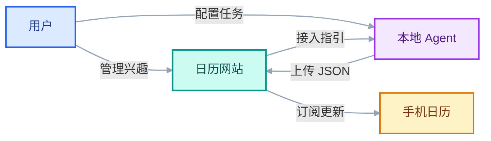

# 兴趣日历项目

## 一、立项目标

**开发一个可被手机日历订阅的公共日历服务，让用户订阅一次，持续获取感兴趣的事件日程。**

- **日历网站：** 提供手机日历订阅、兴趣管理与展示，生成 Agent 接入模板，接收 JSON 并更新日历。
- **本地 Agent：** 如 Codex，独立定时采集、核验信息并上传；任何具备相应能力、遵循接入规范的通用本地 Agent 均可接入。
- **手机日历：** 通过固定地址订阅，自动获取日程及其变更。

## 二、产品范围

MVP 面向单用户，在本机运行网站与数据库，通过局域网供 iPhone 访问。网站与 Agent 独立运行，以配置读取和 JSON 上传接口协作。

### 2.1 网站功能

| 功能 | 要求 |
| --- | --- |
| 兴趣管理 | 添加、删除、查看兴趣；关键词必填，自然语言补充条件可选，例如“周杰伦演唱会 + 只关注上海、杭州” |
| 日程展示 | 默认近期列表，可切换月历、按兴趣筛选，查看详情与来源；网页筛选不改变订阅内容 |
| 手机订阅 | 一份聚合日历、一个固定只读 ICS 地址；增删兴趣无需重新订阅，提供地址复制和 iPhone 操作说明 |
| Agent 接入 | 生成固定指引链接与可复制文案，提供最新兴趣、采集规则、JSON 格式及上传说明 |
| 数据接收 | 校验上传文件，返回结构化回执，入库后及时发布 |
| 状态与异常 | 展示最近接收、导入、发布时间及错误；支持查看和处理候选事件 |

页面采用简洁、美观的响应式布局，适配电脑和 iPhone Safari，突出日程展示与订阅入口。

### 2.2 Agent 职责

Agent 每天读取最新配置，搜索未来 **7 天**的日程，复查已有未来事件的改期与取消，核验来源后生成 JSON 文件并上传。定时任务、单次执行、补跑和上传重试均由 Agent 自身环境负责。

网站不调用模型、不保存模型凭据、不控制 Agent 调度。新增兴趣在 Agent 下次执行时生效；需要立即采集时，用户在 Agent 端发起单次任务。

### 2.3 范围边界

MVP 不包含多租户、用户注册、原生手机 App、收费、双向日历编辑或实时推送。公网部署和其他手机平台作为后续扩展。

## 三、日程规则

### 3.1 来源与时间

- **可信来源：** 优先赛事组织方、主办方、官方票务和品牌公告。每条可发布事件附支持日程的来源链接及证据，搜索摘要不作为唯一依据。
- **不确定信息：** 来源冲突、无法核验或日期模糊的内容保留为候选，不自动发布；不得编造字段以通过校验。
- **时间精度：** 日期与时间明确时发布具体时刻；仅日期明确时作为全天事件，注明“具体时间待定”。补全时间后更新原事件。
- **北京时间：** 任务约定与网站展示使用北京时间（UTC+08:00），境外明确时刻按来源时区换算。仅有日期的事件保留来源日期，不虚构时刻换算；手机显示遵循客户端时区设置。

Agent 负责事实核验，网站负责结构、权限、时间约束和已知冲突检查。JSON 合法或包含来源 URL，不等于内容已被独立证实。

### 3.2 更新与保留

| 场景 | 处理方式 |
| --- | --- |
| 新活动 | 新增日程 |
| 改期或补全时间 | 更新原事件，保留稳定 UID |
| 明确取消 | 提交取消状态与来源证据，更新原事件 |
| 本次未搜到、上传空结果 | 保留已有日程，不推断取消、不清空日历 |
| 多个兴趣命中同一事件 | 合并为一个日历条目；无法可靠匹配时进入复核 |
| 删除兴趣 | 移除其独占的未来日程，保留共享日程与历史日程；拒绝旧配置上传恢复已删除关联 |

通过校验并入库后及时发布。发布失败时保留最后成功快照，恢复后继续发布，旧结果不得覆盖较新版本。

## 四、Agent 接入与数据协议

### 4.1 接入流程

1. 用户在网站配置兴趣，复制接入文案和固定指引链接给 Agent。
2. Agent 根据指引建立每日任务，每次执行先读取最新配置与格式要求。
3. Agent 采集、核验并生成 JSON 文件，上传至网站。
4. 网站整批校验、入库并发布日历，返回可查询的处理回执。

固定指引链接随配置更新内容，修改兴趣无需重新复制文案或重建任务。读取失败时重试，不使用过期配置上传。网站仅展示实际收到的结果，不推断外部 Agent 的运行状态。

指引包含北京时间调度约定、兴趣配置、7 天采集范围、来源规则、版本化 JSON Schema、示例、上传入口和错误码说明。上传凭据独立配置，不嵌入公开链接或订阅内容。

### 4.2 数据结构

| 对象 | 主要内容 |
| --- | --- |
| 批次 | 协议版本、批次 ID、配置版本、生成时间、采集范围与结果状态 |
| 事件 | 稳定来源标识、兴趣 ID、标题、日期或带时区的起止时间、全天标志、地点、状态 |
| 证据 | 来源链接、相关摘录、来源时区、核验时间 |
| 回执 | 请求与批次 ID、导入和发布状态、处理数量、错误位置及建议动作 |

网站保存兴趣及配置版本、事件及版本、来源证据、导入批次、回执和发布记录。Agent 通过接口上传，不直接操作数据库。字段定义、接口路径与版本比较方式由技术设计细化。

### 4.3 整批校验与幂等

- 任一校验错误均整批拒绝，不产生部分事件写入；结构有效但日期模糊的条目可进入候选区，不发布。
- 重复批次 ID 与相同内容返回原结果；同 ID 不同内容拒绝。文件修正后使用新批次 ID，原文件因超时重传则沿用原 ID，并查询回执。
- 配置过期时要求重新读取；旧事件版本不得覆盖新版本。缺失事件不视为删除。
- 回执区分“未导入”“已导入、待发布”“已发布”。导入后的发布失败由网站恢复，无需 Agent 修改已导入文件。

### 4.4 错误码与自动修复

错误回执提供稳定错误码、字段路径、原因、预期约束、建议动作和是否可重试；临时不可用时附等待时间。Agent 根据错误类型处理：

| 错误类别 | 处理动作 |
| --- | --- |
| JSON、字段或协议错误 | 按字段提示修正，必要时重新读取 Schema |
| 时间矛盾或证据不足 | 重新核验来源，无法证实时不编造信息 |
| 配置过期或兴趣无效 | 读取最新配置，调整结果后上传 |
| 批次冲突或事件版本过旧 | 查询回执与事件状态，不通过更换 ID 绕过版本校验 |
| 凭据或权限错误 | 停止自动重试，提示用户处理 |
| 限流或服务暂时不可用 | 保留文件与批次 ID，等待后重试 |

修复与重试设置次数上限，重复失败后报告。错误回执不泄露密钥或内部堆栈；完整错误码与示例纳入接入规范。

## 五、实施计划

项目遵循“需求定义 → 文档 → 开发 → 测试 → 发布”，分四阶段实施。工期依据技术设计与任务拆分估算。

| 阶段 | 交付物 | 完成条件 |
| --- | --- | --- |
| 技术设计 | 技术栈、页面结构、数据模型、JSON Schema、接口、错误码和测试计划 | 能指导网站实现和独立 Agent 接入，包含有效、错误与重试样例 |
| 网站开发 | 兴趣管理、固定指引、上传回执、事件展示、ICS 与发布 | 使用测试 JSON 跑通完整流程，验证增量更新、整批拒绝与幂等 |
| Agent 联调 | 真实采集、每日任务、自动上传与错误修复 | 至少一个通用本地 Agent 完成接入，兴趣变更无需重建任务 |
| 验收发布 | iPhone 回归、7 天试运行、备份恢复、启动与使用说明、版本记录 | 达到第六章验收标准，交付本机 MVP |

代码与数据库迁移纳入版本管理，凭据和运行数据不提交代码仓库；发布保留数据库备份、上一版日历快照和回滚版本。测试事件与真实日程隔离。

## 六、验收标准

### 6.1 网站可用

- 兴趣增删及补充条件可用，重启后数据保留；空关键词和重复组合有明确反馈。
- 近期列表、月历、筛选、详情及来源可用；桌面与 iPhone Safari 无遮挡和横向溢出，触控操作顺畅。
- 指引链接和订阅地址保持稳定；网页筛选不改变订阅，删除兴趣遵循日程保留规则。
- 管理与上传访问保护有效，公开接口不泄露数据库、密钥或内部日志。

### 6.2 Agent 可接入

- 至少一个真实本地 Agent 完成定时读取最新配置、采集未来 7 天日程、生成 JSON 和自动上传。
- 修改兴趣无需重建任务；指引读取失败不使用旧配置上传，上传失败可重试。
- Agent 能按结构化错误回执修正文件；覆盖配置刷新、限流退避、重试上限及权限错误停止。
- 网站无需模型 SDK 或模型凭据即可运行；Agent 停止后网站仍提供最后发布的日历。

### 6.3 数据更新正确

- 真实样本覆盖至少两类兴趣、抽查至少 10 条事件；标题、日期、时区换算与来源全部吻合，所有发布事件有来源。样本不足时补充真实样本，不用测试数据替代。
- 新增、改期、取消、全天事件及时间补全正确；同一事件跨兴趣或重复上传不重复创建。
- 错误批次不部分写入；空结果不清空日历，旧配置不能恢复已删除兴趣，乱序上传不覆盖新版本。
- 凭据撤销、协议错误、导入中断及发布失败均有明确反馈，最后成功日历不受破坏；无回传只显示未更新，不误报采集失败。

### 6.4 iPhone 可订阅

- 正式 MVP 通过固定局域网地址完成系统日历订阅，无需重新订阅即可获取新增、改期和取消。
- 验证后台自动更新，记录服务发布、手机获取与可见时间，以及机型和 iOS 版本。
- 验证 ICS 中文转义、折行、跨日时区、全天事件、稳定 UID 和版本更新，通过解析器与真机回归。

### 6.5 连续运行

连续试运行 **7 天**，记录每日任务、接收与发布结果；模拟休眠或重启后的补跑和恢复，验证备份与回滚，无重复数据，故障可追溯。既有订阅试验不替代正式 MVP 回归。

## 七、风险与后续扩展

| 风险 | 应对 |
| --- | --- |
| 来源失真或冲突 | 优先官方证据，不确定内容暂不发布 |
| 本机离线或手机离网 | 明示可用条件，恢复后重试与补跑 |
| 客户端刷新延迟 | 区分发布和获取时间，不承诺固定周期 |
| Agent 输出或上传失败 | 结构化错误回执、有限重试、幂等导入与旧版保底 |
| 每日采集遗漏临时变化 | 复查未来事件，必要时在 Agent 端单次执行 |

模型调用与搜索用量在联调时测量，用于制定运行预算。开发准备包括首批兴趣、首个联调 Agent 和每日执行时间；具体技术栈、接口及安全配置由技术设计确定。公网部署、其他手机平台和多用户能力不纳入 MVP。

## 参考资料

- [iCloud 日历订阅说明](https://support.apple.com/en-ie/102301)
- [RFC 5545：iCalendar 标准](https://www.rfc-editor.org/info/rfc5545/)
